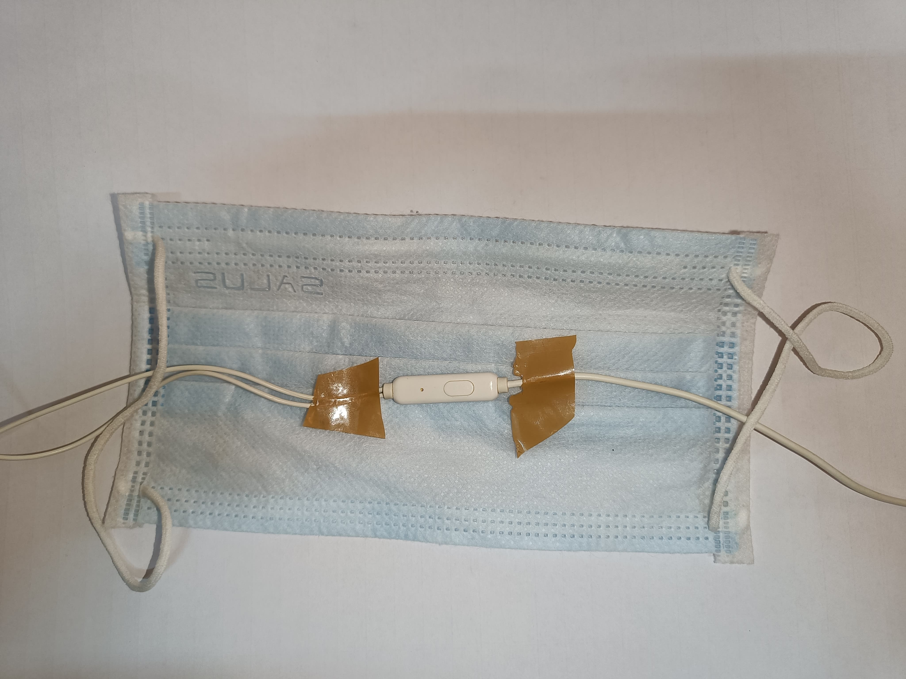

# SpiroMask Mini Project
<!-- TABLE OF CONTENTS -->
<details>
  <summary>Table of Contents</summary>
  <ol>
    <li>
      <a href="#overview">Overview</a>
    </li>
    <li>
      <a href="#process-of-making">Process of making</a>
    </li>
    <li>
      <a href="#project-structure">Project Structure</a>
    </li>
    <li><a href="#requirements">Requirements</a></li>
    <li><a href="#installation-and-setupInstallation and Setup">Installation and Setup</a></li>
    <li><a href="#results">Results</a></li>
    <li><a href="#referrals">Referrals</a></li>
    
  </ol>
</details>

## Overview
I made this mini project with the help of the library librosa which is used for audio processing in python mainly as I belive it will be eventually be integrated with an ml model.

## Process of making
1. First of all I attached the mic on a mask such that it is as near to the mouth as possible like shown below.(placement might differ in a depending on the mic size and the mask shape but due to the constrained time I only had this mask available). 
<div style="text-align:center;">
    
</div>

2. Recorded audio using Audacity after connecting the mic to laptop.

3. Did all the required tasks on the audio recorded.

## Project Structure
The repository is organized as follows:
- `mini-project.ipynb`: Is the main jupyter notebook where all the code is written
- `breathing.wav`: Recorded breathing audio with the help of audacity
- `breathing_filtered_librosa`: Processed breathing audio.
- `requirements.txt`: For downloading required libraries.
- `README.md`: This README file.
- `images`:contain images for the README file.
## Requirements
It was built using Python 3.12.0

## Installation and Setup
1. Clone the repository to your local machine.
   ```sh
   git clone https://github.com/Jay042003/anime-downloader.git
   ```
2. Install requirements.txt by the command given below.
    ```sh
    pip install -r requirements.txt
    ```
## Results:

1. Sampling Rate found is: 44100 Hz(It was also observed while exporting the audio file)
2. Low pass filter of 5kHz used to remove higher frequencies, cut-off frequency decided by frequency domain analysis of the signal
3. It can be said that frequency range of breathing information is between 0-5kHz even in that mainly in range 0 to 2-2.5kHz, decided by observing Power spectral density of the audio signal(both processed and raw).

## Referrals

### Documentations
- [Librosa Documentation](https://librosa.org/doc/latest/index.html)
- [Scipy](https://docs.scipy.org/doc/scipy/)
### Youtube videos
- [Audacity](https://youtu.be/IXoGmyzNZOY?si=WaCChGUzmqgyTXKf)
